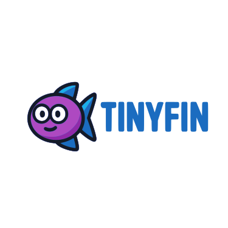

# tinyfin

<p align="center">
  
</p>

tinyfin is a small, educational deep learning library in C. It ships a minimal autograd engine, thin Python ctypes bindings, and optional BLAS/CUDA backends.

Quick start

Build the shared library, compile the tests, and run smoke checks:

```bash
# build the shared library (libtinyfin.so)
make -j2 libtinyfin.so

# build test binaries
make -j2 tests

# run C unit tests (binaries land in project root)
./tests/test_div_exp

# run Python smoke tests
python3 tests/python/test_div_exp_py.py
```

Build and test

- Build everything (shared lib + tests): `make -j2`
- Build only the shared library: `make -j2 libtinyfin.so`
- Build only tests: `make -j2 tests`
- Test binaries are placed in the project root; list them with `ls tests/` and run directly.
- Python tests live in `tests/python/` and expect the shared library to be built first.

CUDA build and run

- Build CUDA-enabled shared library (requires `nvcc` on PATH):
  `make -j2 libtinyfin.so ENABLE_CUDA=1`
- Optional: enable cuBLAS matmul when available:
  `make -j2 libtinyfin.so ENABLE_CUDA=1 ENABLE_CUBLAS=1`
- Run CUDA profiler from this repo (ensure local bindings are used):
  `PYTHONPATH=python TINYFIN_BACKEND=cuda python3 examples/perf_profile.py cuda 512 512 512 20`
- If the backend still reports CPU, confirm you are loading the local bindings:
  `PYTHONPATH=python python3 -c "import tinyfin; print(tinyfin.__file__)"`

Using tinyfin

- C: include headers from `include/tinyfin/` and link against `libtinyfin.so`.
- Python: import via `import tinyfin` after building the shared library (ctypes loads `libtinyfin.so`).
- For local development from this repo, set `PYTHONPATH=python` so Python imports `python/tinyfin.py`.
- Examples in `examples/` are ready to run once the shared library is built.

Highlights

- C core in `src/`, headers in `include/tinyfin/`.
- Python bindings in `python/tinyfin.py` with public modules `tinyfin.tensor`, `tinyfin.nn`, `tinyfin.optim`, `tinyfin.utils`, `tinyfin.data`.
- Training utilities: `DataLoader`, `Trainer`, callbacks (`LoggingCallback`, `CheckpointCallback`), schedulers (`StepLR`, `ExponentialLR`, `LinearWarmupLR`), and optimizers (`SGDOpt`, `AdamOpt`, `RMSPropOpt`).
- NN helpers: `Embedding`, `MLP`, `Flatten`, `MaxPool2d`, and `CrossEntropyLoss`.
- Tensor helpers: `from_numpy`, `reshape`, `squeeze/unsqueeze`, `maxpool2d/avgpool2d` with shape validation.
- Numerical stability helpers: stable softmax/log-softmax, epsilon guards, exp clamp, `Tensor.has_nan_or_inf`, and `assert_finite`.

Examples

```python
from tinyfin import Tensor

x = Tensor.new([1, 3, 4, 4])
pooled = x.maxpool2d(2)          # -> shape [1, 3, 2, 2]
flat = pooled.reshape([1, 12])
sq = flat.squeeze()              # removes dims of size 1
```

- `examples/` includes torch-free demos: MNIST MLP, CIFAR-like CNN, tiny transformer-style FFN, CUDA matmul demo, perf profiler, and autograd graph export.
- `tinyfin.data` ships `load_mnist` and `load_cifar10`; examples download data when present, otherwise use synthetic data.

Docs and guides

- `docs/api.md`: short Python API stub.
- `docs/backends.md`: backend selection and `TINYFIN_BACKEND` toggle (CPU default; CUDA/BLAS optional).
- `docs/examples.md`: example roadmap and status.
- `docs/howto.md`: short how-to recipes for common tasks.
- `docs/mixed_precision.md`: stubbed `tinyfin.autocast` / `set_mixed_precision`.

Status

tinyfin is intentionally minimal. Missing pieces for a full framework include memory safety hardening, richer ops/layers, faster kernels, dataset workers, stable serialization, and formal API versioning.

Contributing

Issues and PRs are welcome for new ops, autograd fixes, or performance work. See `roadmap.md` for planned milestones.
